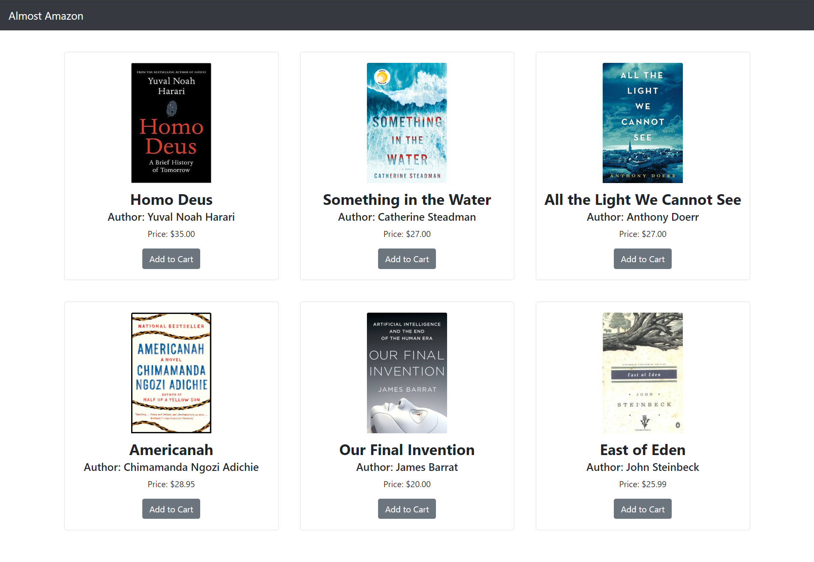
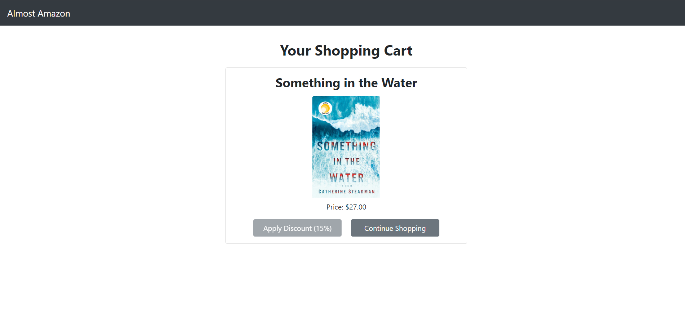
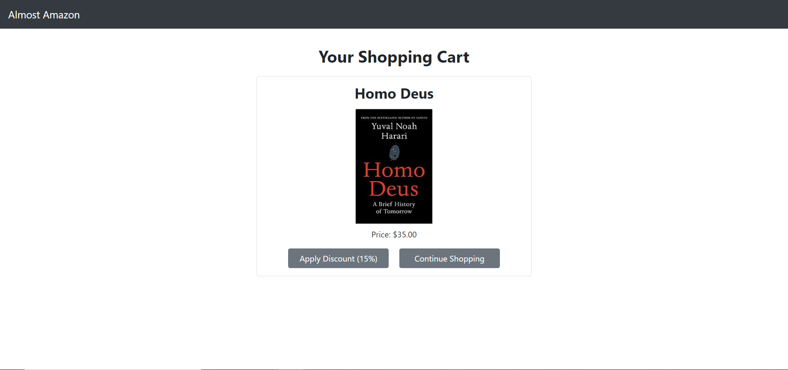
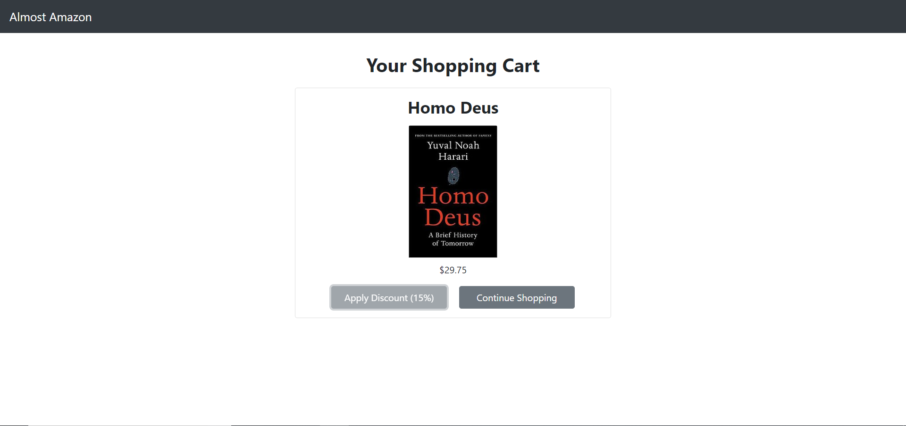

# almost-amazon

### Description
You will be building a modular version of the greatest book store known to humankind - Almost Amazon. This bookstore has a single book (of your choosing) and some awesome realated styling (if you would like).

At minimum your Almost Amazon site should have:
1. A store with a single book
2. The ability to put the book in your cart

### Technologies Used
* Bootstrap 4
* HTML 5
* CSS
* Javascript
* ES6 Modules

### Screenshots
Homescreen

Book that can't be discounted

Book before discount

Book after discount


### How to run this project
* Use npm to install http-server in your terminal:
```sh
npm install -g http-server
```
* Run the server in your terminal
```sh
hs -p 9999
```
* Open chrome and navigate to:
```
localhost:9999
```

### Contributors
[Maggie Leavell](https://github.com/mjleavell)